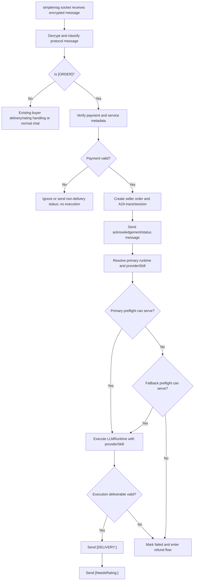

# Skill-Service Provider Runtime Design

Date: 2026-05-07
Status: Spec for implementation planning

## Context for the Implementer

This document is written for a new AI development session that does not have the conversation history that produced it. Treat this file as the source of truth for the feature boundary and the phased acceptance gates.

Primary project:

- Open Agent Connect implementation workspace: `<repo-root>`
- `<repo-root>` means the root of the new feature worktree created for implementation, not necessarily the main checkout where this document was authored.
- Project instructions: `<repo-root>/AGENTS.md`
- The implementation session should create or use a dedicated worktree and same-name branch before code changes, then resolve `<repo-root>` with `pwd -P` inside that worktree.
- All documentation, skill documents, and code comments must be written in English.
- Do not introduce new code or documentation that depends on the legacy `.metabot/hot` layout.

Reference implementation:

- IDBots workspace: `/Users/tusm/Documents/MetaID_Projects/IDBots/IDBots`
- OAC should deeply copy the relevant IDBots behavior and semantics, not its storage engine or UI framework.

Owner-approved product decisions:

- The on-chain `/protocols/skill-service` payload must not include runtime information.
- `providerSkill` remains only a skill name, matching IDBots.
- `/ui/publish` skill choices must come only from the selected MetaBot's primary runtime skill roots.
- `/ui/publish` must not ask the user to choose a runtime. Runtime choice belongs to `/ui/bot`.
- A MetaBot without a configured usable primary runtime is unavailable for skill-service publishing.
- Fallback runtime is allowed only for pre-execution unavailability: primary skill missing, primary runtime unhealthy/unavailable, primary runtime missing binary, or primary runtime cannot start before an LLM session begins.
- Once the primary runtime starts execution, failures, timeouts, invalid outputs, or delivery failures must not retry on fallback. They enter the order failure/refund path.

## Goal

Bring Open Agent Connect local MetaBots to IDBots-compatible `skill-service` provider behavior:

- publish a paid local capability from CLI and `/ui/publish`;
- receive a remote paid order over private `simplemsg`;
- execute the requested skill through the local LLM runtime system;
- deliver the result and rating request through the existing A2A/private-chat protocol;
- move failed or timed-out paid orders into the correct refund workflow.

The implementation should preserve the IDBots protocol shape while adapting execution to OAC's multi-runtime model.

## Non-Goals

- Do not add runtime identity, runtime id, binary path, cwd, or model metadata to the on-chain `/protocols/skill-service` payload.
- Do not add a runtime picker to the publish form.
- Do not make `providerSkill` globally discoverable across all 11 platform skill roots during publish.
- Do not retry an order on the fallback runtime after the primary runtime has already started executing it.
- Do not depend on the legacy `.metabot/hot` layout.

## Current-State Evidence

OAC already has the core pieces, but the provider execution path is still incomplete:

- Platform skill roots are registered in `src/core/platform/platformRegistry.ts`. OAC currently defines 11 platforms: `claude-code`, `codex`, `copilot`, `opencode`, `openclaw`, `hermes`, `gemini`, `pi`, `cursor`, `kimi`, and `kiro`.
- Skill injection exists in `src/core/llm/executor/skill-injector.ts`. It copies requested skills from the executor's shared `skillsRoot` into the platform project root, such as `<cwd>/.codex/skills` for Codex.
- LLM execution supports `skills?: string[]` in `src/core/llm/executor/executor.ts`, and each run records the selected runtime, provider, prompts, skill names, and result.
- Runtime/binding resolution exists in `src/core/llm/llmRuntimeResolver.ts`, but generic chat fallback may try multiple runtimes. The skill-service provider path needs stricter fallback semantics.
- Service publishing already writes `/protocols/skill-service` through `src/core/services/publishService.ts` and `src/core/services/servicePublishChain.ts`. The payload already matches the desired protocol direction: `providerSkill` is a skill name, not a runtime-bound identifier.
- `/ui/publish` currently uses a manual text input for `providerSkill` in `src/ui/pages/publish/app.ts`. It does not load or validate the selected MetaBot's primary runtime skills.
- `metabot services publish --payload-file` in `src/cli/commands/services.ts` sends the JSON payload to the publish handler without local skill availability validation.
- `/api/services/execute` exists in `src/daemon/routes/services.ts`, but the current handler in `src/daemon/defaultHandlers.ts` registers a demo runner and returns a synthetic response instead of calling `LLMRuntime + providerSkill`.
- Private chat ingestion in `src/cli/runtime.ts` calls `handleInboundOrderProtocolMessage`, but the current handler only processes buyer-side delivery/rating follow-up messages. It does not treat inbound `[ORDER]` as a provider order to execute.
- Refund support exists but is partial. `src/core/orders/manualRefund.ts`, `/ui/refund`, `/api/provider/refunds/initiated`, and `/api/provider/refund/confirm` model some state transitions, but OAC does not yet mirror IDBots' full automatic refund-request and seller settlement flow.

IDBots should be the behavior reference:

- `gigSquareServiceMutationService.ts` publishes `providerSkill` as a plain skill name and `endpoint: simplemsg`.
- `privateChatDaemon.ts` handles inbound `[ORDER]` before generic chat, verifies payment, creates seller order state, sends acknowledgement, builds order prompts, runs the selected skill, sends `[DELIVERY:<orderTxid>]`, and sends `[NeedsRating:<orderTxid>]`.
- `orderPromptBuilder.ts` adds strict paid-order context and requires the selected skill.
- `privateChatOrderCowork.ts` manages execution session state, status notices, timeout fallback text, artifact validation/upload, delivery, and rating invite.
- `serviceOrderLifecycleService.ts` models buyer/seller order states, timeout scans, refund request creation, retry, zero-price skip, and rating timeout closure.
- `serviceRefundSettlementService.ts` validates refund requests, sends refund transfer, writes refund finalization proof, and marks mirrored orders refunded.

## Reference Module Map

Use these files as the first reading list before implementation. The new development session should inspect the current versions of these files before editing.

For OAC files, paths are written relative to `<repo-root>`, the implementation worktree root. Do not edit the main checkout only because an absolute path from the original authoring session exists elsewhere.

OAC files:

- `<repo-root>/src/core/platform/platformRegistry.ts`: supported platforms and skill roots.
- `<repo-root>/src/core/llm/executor/executor.ts`: LLM session creation, skill injection hook, runtime backend execution, session result storage.
- `<repo-root>/src/core/llm/executor/skill-injector.ts`: current pre-execution skill copy behavior.
- `<repo-root>/src/core/llm/llmRuntimeResolver.ts`: current generic runtime resolution behavior.
- `<repo-root>/src/core/llm/llmTypes.ts`: runtime and binding types, including primary/fallback binding roles.
- `<repo-root>/src/core/bot/metabotProfileManager.ts`: MetaBot profile and provider binding management.
- `<repo-root>/src/core/services/publishService.ts`: local service publish record builder.
- `<repo-root>/src/core/services/servicePublishChain.ts`: `/protocols/skill-service` chain write.
- `<repo-root>/src/core/discovery/chainServiceDirectory.ts`: chain service parser.
- `<repo-root>/src/core/a2a/provider/serviceRunnerContracts.ts`: current provider runner result contract.
- `<repo-root>/src/core/a2a/provider/serviceRunnerRegistry.ts`: current demo runner registry.
- `<repo-root>/src/core/a2a/protocol/orderProtocol.ts`: order protocol message helpers.
- `<repo-root>/src/core/orders/delegationOrderMessage.ts`: buyer-side order message construction.
- `<repo-root>/src/core/orders/orderMessage.ts`: order message parsing/formatting.
- `<repo-root>/src/core/orders/orderLifecycle.ts`: current shared lifecycle constants.
- `<repo-root>/src/core/orders/manualRefund.ts`: current manual refund decision helper.
- `<repo-root>/src/core/chat/sessionTrace.ts`: trace/order projection fields and refund markers.
- `<repo-root>/src/core/state/runtimeStateStore.ts`: local JSON runtime state shape.
- `<repo-root>/src/daemon/defaultHandlers.ts`: service publish/execute/rate/refund handlers, private order follow-up handling, trace persistence wiring.
- `<repo-root>/src/daemon/routes/services.ts`: `/api/services/*` routes.
- `<repo-root>/src/daemon/routes/provider.ts`: provider refund routes.
- `<repo-root>/src/cli/runtime.ts`: private `simplemsg` listener and order protocol dispatch.
- `<repo-root>/src/cli/commands/services.ts`: service CLI commands.
- `<repo-root>/src/ui/pages/publish/app.ts`: publish UI.
- `<repo-root>/src/ui/pages/my-services/app.ts`: provider console UI.
- `<repo-root>/src/ui/pages/refund/app.ts`: refund UI.
- `<repo-root>/src/ui/pages/trace/sseClient.ts`: trace UI event/field handling.

IDBots files:

- `/Users/tusm/Documents/MetaID_Projects/IDBots/IDBots/src/main/services/gigSquareServiceMutationService.ts`: service publish/mutation semantics, including plain `providerSkill` and `endpoint: simplemsg`.
- `/Users/tusm/Documents/MetaID_Projects/IDBots/IDBots/src/main/services/privateChatDaemon.ts`: inbound `[ORDER]` handling, payment verification, seller order creation, acknowledgement, delivery, rating, and refund-triggering behavior.
- `/Users/tusm/Documents/MetaID_Projects/IDBots/IDBots/src/main/services/orderPromptBuilder.ts`: paid-order prompt construction and required-skill instruction.
- `/Users/tusm/Documents/MetaID_Projects/IDBots/IDBots/src/main/services/privateChatOrderCowork.ts`: provider execution session lifecycle, timeout handling, deliverable validation, artifact upload, delivery text, and rating invite.
- `/Users/tusm/Documents/MetaID_Projects/IDBots/IDBots/src/main/services/serviceOrderLifecycleService.ts`: buyer/seller order states, timeout scans, refund request creation, retry, and rating timeout closure.
- `/Users/tusm/Documents/MetaID_Projects/IDBots/IDBots/src/main/services/serviceRefundSettlementService.ts`: seller refund settlement, refund transfer, finalization proof, mirrored order updates.
- `/Users/tusm/Documents/MetaID_Projects/IDBots/IDBots/src/main/main.ts`: refund request payload construction and `/protocols/service-refund-request` pin creation wiring.

## Protocol Decisions

`providerSkill` remains the only skill identifier in `/protocols/skill-service`.

The public protocol describes a service API, not the local machine that executes it. A service provider is responsible for keeping its MetaBot's runtime, model, wallet, and skill files available. Remote callers should not need to know whether the provider executes through Codex, Claude Code, Gemini, or another OAC platform.

Required on-chain publish semantics stay IDBots-compatible:

- path: `/protocols/skill-service`
- endpoint: `simplemsg`
- `providerSkill`: skill name only
- provider identity: local MetaBot id and `providerGlobalMetaId`
- payment fields: existing OAC/IDBots-compatible settlement fields
- service metadata: service name, display name, description, icon, price, currency, output type, and skill document

Runtime details may appear in local UI, local logs, local trace metadata, and diagnostics, but not in the chain payload.

## Runtime and Skill Selection Rules

Publishing is tied to the selected MetaBot's configured primary runtime.

For publish-time skill listing:

1. Resolve the selected MetaBot.
2. Resolve its enabled `primary` LLM binding to a concrete runtime.
3. If no usable primary runtime exists, mark the MetaBot unavailable for skill-service publishing.
4. Read skills only from that primary runtime provider's configured skill roots in `platformRegistry.ts`.
5. Show those skills in `/ui/publish` as the available `providerSkill` values.
6. Do not show skills from fallback runtime roots during publish.
7. Do not show skills from other supported platform roots during publish.

If the selected primary runtime is Codex, the publish list comes from Codex skill roots, such as `CODEX_HOME/skills` or `~/.codex/skills` and project `.codex/skills`, according to the platform registry. It must not automatically include Claude, Gemini, Cursor, or other platform skill roots.

For provider execution:

1. Resolve the published service by `servicePinId` and provider identity.
2. Read its `providerSkill` from local service state or refreshed chain service metadata.
3. Resolve the local MetaBot's primary runtime.
4. If primary is usable and the skill exists in the primary runtime skill roots, execute with primary.
5. If primary has no matching skill, is marked unavailable, lacks a binary path, cannot start, or fails preflight before execution begins, try the fallback runtime.
6. Fallback is allowed only when execution has not started.
7. If primary starts execution and the run fails, times out, is cancelled, or returns an invalid deliverable, do not rerun on fallback. Treat the order as failed and enter the refund path when payment requires it.

This makes fallback a pre-execution availability safety net, not a semantic retry mechanism.

## Publish Flow

### UI Publish

`/ui/publish` should become a provider console for one selected local MetaBot:

- show the publishing MetaBot name, slug, and `globalMetaId`;
- show the resolved primary runtime display name, provider, health, and version if available;
- disable publishing when identity is missing, no primary runtime is configured, the runtime is unavailable, or no primary skill roots are readable;
- replace the free-text `providerSkill` input with a skill selector populated from the primary runtime skill roots;
- keep an advanced/manual override out of V1 unless needed for debugging later;
- submit the same chain-backed payload to `/api/services/publish`;
- after success, show the service pin, current pin, price, output type, selected skill, and local service state.

The UI should not let a user choose a runtime at publish time. If the primary runtime does not have the desired skill, the user should update the MetaBot's `/ui/bot` runtime configuration or install the skill into the primary runtime's skill root first.

### CLI Publish

The initial CLI path can keep the existing payload-file model, but it should validate before chain publishing:

- require local identity;
- resolve the active or explicitly selected MetaBot, using the same provider identity rules as the UI;
- require a usable primary runtime binding;
- validate `providerSkill` against the primary runtime skill catalog;
- return a structured error before writing on-chain if the skill is missing or the runtime is unavailable.

A future debug flag can bypass local validation for migration or recovery, but the normal command should not publish an unavailable local service.

## Provider Order Flow

Inbound order handling should be moved from the current demo HTTP-only runner into the private-chat provider path.



The provider path should process `[ORDER]` messages before generic private-chat auto replies, matching IDBots. Order messages are new paid tasks, not replies to an existing buyer-side order.

The existing `/api/services/execute` route can remain as a local/test/provider-daemon hook, but it must delegate to the same provider order runner instead of carrying a separate demo implementation. Private chat is the primary remote execution transport for IDBots compatibility.

## LLM Runtime Execution

Introduce a provider service runner that wraps OAC's LLM runtime executor:

- input: service record, order message metadata, buyer identity, payment metadata, user task, task context, and `providerSkill`;
- output: completed response, clarification/failure result, local trace/session references, and delivery metadata;
- dependencies: runtime store, binding store, platform skill catalog, LLM executor, session/trace state stores, chain/private-message sender, and refund lifecycle service.

Prompt construction should follow IDBots' `orderPromptBuilder` semantics:

- clearly state this is a paid service order;
- include the client request and display summary;
- require the selected `providerSkill`;
- include expected output type;
- instruct the runtime not to repeat payment metadata, service ids, greetings, or rating boilerplate in the final answer;
- for non-text outputs, require an actual local file path and validate/upload the artifact before delivery.

Execution should call `LlmExecutor.execute` with:

- `metaBotSlug` for local ownership;
- the resolved runtime id and runtime object;
- `skills: [providerSkill]`;
- the order user prompt and system prompt;
- a controlled working directory compatible with OAC's storage layout;
- timeout/cancellation policy owned by the provider order runner.

The current `skill-injector` can still support project-root binding when needed, but provider skill discovery must not depend on copying from a generic shared root. A skill is considered executable when it exists in the selected runtime provider's skill roots before execution, or when the platform-specific project root already contains it.

## Skill Catalog Service

Add a small local skill catalog service rather than embedding filesystem scans in UI handlers:

- resolve platform skill roots from `platformRegistry.ts`;
- expand environment-aware roots such as `CODEX_HOME`;
- support global and project roots;
- ignore unsafe skill directory names;
- read skill metadata from `SKILL.md` when available;
- deduplicate by skill name with deterministic root precedence;
- expose a daemon endpoint for `/ui/publish`;
- expose a command dependency for CLI validation.

The catalog should return:

- `skillName`;
- root id and absolute path;
- platform id and display name;
- title/description if present in `SKILL.md`;
- readability/status diagnostics.

The catalog should not mutate skill directories.

## Order State and Trace Persistence

The provider lifecycle should reuse OAC's existing JSON runtime state model and A2A session/trace projections, not introduce SQLite.

Minimum seller-side states:

- `received`: order message parsed and payment pending/verified;
- `acknowledged`: provider sent first status response;
- `in_progress`: LLM runtime session started;
- `completed`: delivery sent successfully;
- `rating_pending`: delivery sent and rating requested;
- `failed`: execution, validation, or delivery failed;
- `refund_pending`: refund request exists and seller action or settlement is pending;
- `refunded`: refund finalized or zero-price/self-directed order resolved locally;
- `ended`: rating timeout or explicit order-end protocol closed the order.

Every order should be linkable by:

- local MetaBot id/slug;
- provider `globalMetaId`;
- buyer `globalMetaId`;
- service pin id/current pin id;
- `providerSkill`;
- order message pin/txid;
- payment txid/commit txid;
- runtime session id when execution starts;
- trace id and A2A session id.

Trace UI should show runtime choice as local diagnostic metadata, but that metadata must not become a protocol requirement.

## Refund Behavior

Refund behavior should be IDBots-compatible and payment-aware.

Automatic refund request creation is buyer-side behavior. It should trigger when the buyer-side order times out, receives an invalid deliverable, or detects a delivery artifact failure. The buyer writes `/protocols/service-refund-request` with payment, service, buyer/seller, destination address, failure reason, and evidence pin ids.

Seller-side refund settlement is provider behavior. When this local OAC MetaBot receives or detects a valid refund request for one of its seller orders, it should:

1. validate the refund request pin and payload;
2. ensure the request matches the seller order payment, service, buyer, seller, currency, chain, and amount;
3. skip transfer for zero-price orders and mark both mirrored orders refunded locally;
4. perform the refund transfer for paid orders through the existing wallet/chain adapter;
5. write a refund finalization proof protocol record;
6. mark seller and mirrored buyer records as `refunded`;
7. surface the result in `/ui/my-services`, `/ui/refund`, and trace history.

Manual refund remains a necessary fallback when automatic settlement cannot safely complete, such as missing destination address, unsupported settlement asset, insufficient seller balance, chain transfer failure, or ambiguous refund request data. The current manual refund route should evolve from local state confirmation to real settlement/finalization semantics modeled after IDBots' `serviceRefundSettlementService.ts`.

## Error Handling Rules

Use structured failures that can be shown in CLI, UI, trace, and private chat status messages.

Pre-execution failures that may use fallback:

- no matching skill in primary runtime roots;
- primary runtime missing binary path;
- primary runtime marked unavailable;
- primary runtime preflight cannot start;
- primary runtime provider backend is unavailable before creating an LLM session.

Execution failures that must not use fallback:

- LLM session started and returned `failed`;
- LLM session timed out;
- runtime produced empty output;
- runtime ignored the required skill;
- non-text deliverable file missing, invalid, or too large;
- delivery message could not be sent after a valid result was produced.

Failure-to-deliver paid orders should enter refund handling unless the order is free, self-directed, already refunded, or otherwise explicitly excluded by lifecycle rules.

## UI Impact

`/ui/bot` remains the place where a MetaBot's primary and fallback runtimes are configured.

`/ui/publish` should become runtime-aware but not runtime-selecting:

- read-only MetaBot identity panel;
- read-only primary runtime panel;
- primary skill selector;
- publish availability banner;
- structured validation errors before chain write.

`/ui/my-services` should show seller-side order health:

- active orders;
- failed orders;
- refund-pending orders;
- manual-action-required items;
- runtime/session links for provider executions.

`/ui/refund` should expand beyond buyer-initiated history:

- buyer refund requests initiated by this local MetaBot;
- seller refund requests received by this local MetaBot;
- settlement status and finalization proof;
- manual refund action when automatic settlement is blocked.

`/ui/trace` should show the provider runtime/session diagnostics for local seller executions and the existing buyer-side delivery/rating chain events.

## CLI Impact

Keep the existing command family:

- `metabot services publish --payload-file <path>`;
- `metabot services call --request-file <path>`;
- `metabot services rate --request-file <path>`.

Add or extend machine-first commands only where they support validation and operations:

- list publishable skills for the selected MetaBot's primary runtime;
- validate a publish payload without chain writing;
- inspect seller-side orders;
- process a pending manual refund by order id.

The publish command should fail before chain write when the active MetaBot cannot serve the selected `providerSkill`.

## Testing Strategy

Unit tests:

- platform skill catalog root expansion and deduplication;
- safe skill name validation;
- publish validation against primary runtime only;
- primary/fallback runtime preflight decision table;
- no fallback after execution has started;
- prompt builder paid-order requirements;
- order lifecycle state transitions;
- refund request validation and settlement payload generation.

Integration tests:

- publish UI endpoint returns only primary runtime skills;
- CLI publish rejects missing primary runtime skill;
- inbound `[ORDER]` creates seller trace/session and starts runtime execution;
- successful execution sends delivery and rating request messages;
- primary missing skill uses fallback before execution;
- primary execution timeout creates failed/refund-required state without fallback retry;
- manual refund confirmation performs settlement/finalization or returns a clear blocking error.

Reference compatibility tests:

- parse IDBots-style `[ORDER]`, `[DELIVERY:<orderTxid>]`, and `[NeedsRating:<orderTxid>]`;
- publish payload stays IDBots-compatible and contains no runtime fields;
- refund request/finalize payloads stay IDBots-compatible.

Real-chain acceptance:

- Later implementation phases should include real-chain smoke tests when the phase touches chain publishing, chain reads, paid order delivery, rating, or refund settlement.
- The local `eric` MetaBot profile can be used for real-chain validation. Its local account material, including mnemonic or wallet secrets, is stored under `~/.metabot/profiles/eric` in a hidden subdirectory on this machine.
- The implementation session may use that local profile for test publishing and data retrieval, but must never copy mnemonic words, private keys, or other wallet secrets into source code, tests, documentation, logs, commits, buzz posts, or subagent prompts.
- Real-chain acceptance should verify observable chain data, such as actual `/protocols/skill-service`, `/protocols/simplemsg`, `/protocols/skill-service-rate`, `/protocols/service-refund-request`, or refund finalization pins, rather than relying only on local JSON state.
- Any real-chain test must record non-secret evidence: pin id, txid, protocol path, provider/caller `globalMetaId`, service pin id, order txid, payment txid, refund request pin id, refund txid, and finalization pin id as applicable.
- If real-chain validation is skipped for an environmental reason, the phase acceptance report must say exactly why it was skipped and which local tests substitute for it. Chain-writing phases should not be marked finally accepted until real-chain evidence exists.

## Mandatory Development Process

Development must happen in phases. A phase is not complete until all of these are true:

1. The phase's local implementation is complete.
2. Relevant automated tests pass. If a test cannot run, the developer must document the exact command attempted, the failure, and why it is environmental rather than product failure.
3. A `gpt-5.5` code-review subagent reviews the changed files for defects, regressions, protocol drift, missing tests, and maintainability problems.
4. A separate `gpt-5.5` acceptance subagent validates the phase against the objective acceptance criteria in this document.
5. Both subagents return a clear pass/approved result, or every reported issue is fixed and the same phase gate is rerun.
6. The phase is committed as one independent, verifiable commit.
7. After the commit, the developer uses the `metabot-post-buzz` skill to post a detailed on-chain development diary for that phase.

This project-specific process intentionally requires `gpt-5.5` for the phase code-review and acceptance subagents. If `gpt-5.5` is unavailable in the development environment, stop and ask the human owner before substituting another model.

The review subagent and acceptance subagent must be separate agents. Do not ask one subagent to do both jobs. Do not proceed to the next phase while either subagent has an unresolved failing finding.

Recommended code-review subagent prompt shape:

```text
You are reviewing phase <N> of the OAC skill-service provider runtime project.
Use model gpt-5.5.
Review only the changed files and the phase requirements in docs/superpowers/specs/2026-05-07-skill-service-provider-runtime-design.md.
Focus on bugs, protocol incompatibility with IDBots, incorrect runtime fallback behavior, missing tests, data-loss risks, and UI/CLI regressions.
Return findings ordered by severity with exact file/line references. If no issues, say APPROVED and list residual risks.
```

Recommended acceptance subagent prompt shape:

```text
You are the acceptance validator for phase <N> of the OAC skill-service provider runtime project.
Use model gpt-5.5.
Read docs/superpowers/specs/2026-05-07-skill-service-provider-runtime-design.md.
Validate the implementation against every acceptance criterion listed for phase <N>.
Run or inspect the specified tests where possible.
Return PASS only if every criterion is satisfied. Otherwise return FAIL with the exact unmet criteria and evidence.
```

Every phase commit message should summarize the user-visible outcome, not just the internal files changed. The development diary should include:

- phase number and goal;
- key files changed;
- protocol or runtime decisions preserved;
- tests and verification commands run;
- code-review subagent result;
- acceptance subagent result;
- known risks or deferred items.

## Phased Implementation and Acceptance Gates

### Phase 1: Primary Runtime Skill Catalog and Publish Validation

Goal: create a reusable skill catalog and enforce that publishable skills come only from the selected MetaBot's primary runtime skill roots.

Implementation scope:

- Add a local platform skill catalog service.
- Resolve MetaBot primary runtime from existing runtime/binding stores.
- Read only the primary runtime provider's skill roots from `platformRegistry.ts`.
- Expand env-aware home roots such as `CODEX_HOME`.
- Include project roots according to the platform registry and the selected execution workspace decision made during implementation.
- Add daemon and CLI-facing validation helpers.
- Do not change chain publish payload shape.

Objective acceptance criteria:

- Given a MetaBot with primary provider `codex` and fallback provider `claude-code`, the skill catalog returns Codex skills and returns zero Claude-only skills.
- Given a MetaBot with no primary runtime binding, publish validation fails before chain write with a stable machine-readable error code.
- Given a primary runtime with health `unavailable`, publish validation fails before chain write with a stable machine-readable error code.
- Given a primary runtime with no matching `providerSkill`, publish validation fails before chain write with a stable machine-readable error code.
- Given a matching primary skill, publish validation succeeds and returns the selected skill name, platform id, runtime id, and root diagnostics for local use only.
- No runtime id, runtime provider, binary path, cwd, model, or skill root path is added to the `/protocols/skill-service` chain payload.
- Skill names containing `/`, `\`, `..`, or empty/whitespace-only names are rejected by catalog and publish validation.
- Real-chain publish smoke validation using the local `eric` profile proves that a valid published `/protocols/skill-service` pin contains `providerSkill` and does not contain runtime metadata. Record the pin id and txid as non-secret evidence.
- Unit tests cover at least: Codex primary with fallback exclusion, missing primary runtime, unavailable primary runtime, missing skill, unsafe skill name, and no runtime fields in publish payload.
- `npm test` or the repository's relevant targeted test command passes before commit.

Phase 1 cannot pass if any publish path can write an on-chain service record with a missing or invalid primary-runtime skill.

### Phase 2: Publish UI and CLI UX

Goal: make service publishing user-safe and primary-runtime-aware in `/ui/publish` and CLI.

Implementation scope:

- Update `/ui/publish` to show selected MetaBot identity and primary runtime details.
- Replace manual `providerSkill` text entry with a selector populated from the Phase 1 catalog.
- Disable publish when identity, primary runtime, or primary skill catalog is unavailable.
- Keep runtime selection out of `/ui/publish`.
- Extend CLI publish validation while preserving `metabot services publish --payload-file <path>`.
- Add a machine-readable way to list publishable skills for the active/selected MetaBot if needed by CLI tests.

Objective acceptance criteria:

- `/ui/publish` displays the selected MetaBot name/slug and `globalMetaId` when identity exists.
- `/ui/publish` displays the primary runtime provider/display name and health, and does not display a runtime picker.
- The skill selector contains only skills returned by the primary runtime catalog endpoint.
- The submit button is disabled when there is no identity, no primary runtime, no readable primary skill root, or no matching skill.
- Browser-side submit payload contains `providerSkill` and existing service fields but contains no runtime fields.
- Server-side publish handler revalidates `providerSkill`; bypassing the UI cannot publish an invalid skill.
- CLI publish with a payload whose `providerSkill` is missing from the primary runtime fails before chain write.
- CLI publish with a valid primary runtime skill reaches the existing chain publish flow.
- A real-chain publish through UI or CLI using the local `eric` profile creates a service pin that can be read back and parsed by OAC's chain service directory.
- Tests or browser automation verify both enabled and disabled UI states.
- `npm test` or the repository's relevant targeted test command passes before commit.

Phase 2 cannot pass if the browser can submit a service for a fallback-only skill or if the server trusts browser-side validation alone.

### Phase 3: LLM-Backed Provider Service Runner

Goal: replace the demo service execution response with a provider runner that calls OAC's LLM runtime executor using the requested `providerSkill`.

Implementation scope:

- Add an LLM-backed provider service runner around `LlmExecutor`.
- Build order prompts based on IDBots' `orderPromptBuilder.ts`.
- Select primary runtime first, fallback only for pre-execution unavailability.
- Pass `skills: [providerSkill]` into `LlmExecutor.execute`.
- Track whether execution has started so fallback is impossible after session creation.
- Keep `/api/services/execute` as a local/test hook that delegates to the same runner.

Objective acceptance criteria:

- `/api/services/execute` no longer returns `renderDemoRemoteServiceResponse` for real provider service execution.
- A successful mocked runner call creates exactly one LLM session and passes the requested `providerSkill` as a single-item `skills` array.
- Generated system prompt includes paid-order context, required skill instruction, expected output type, and "do not repeat payment/service boilerplate" guidance.
- If primary runtime lacks the skill and fallback runtime has it, execution uses fallback and records that fallback was selected before execution.
- If primary runtime is unavailable before session creation and fallback can serve, execution uses fallback.
- If primary runtime creates an LLM session and then returns `failed`, `timeout`, `cancelled`, empty output, or invalid deliverable, fallback is not called.
- If neither primary nor fallback can serve before execution, the runner returns a structured failed result and no LLM session is created.
- Local trace/session metadata may include selected runtime diagnostics, but no runtime fields are written into service protocol payloads.
- Unit tests cover the complete fallback decision table and assert "no fallback after started".
- `npm test` or the repository's relevant targeted test command passes before commit.

Phase 3 cannot pass if any execution-started failure can trigger a fallback runtime retry.

### Phase 4: Private-Chat Inbound `[ORDER]` Provider Flow

Goal: make OAC respond to remote paid orders over private `simplemsg` like IDBots.

Implementation scope:

- Classify inbound `[ORDER]` messages before generic private-chat auto reply.
- Verify payment before executing.
- Resolve service and `providerSkill` from local service state or chain-compatible service metadata.
- Create seller-side order state and A2A trace/session records.
- Send acknowledgement/status before execution when possible.
- Run the Phase 3 provider service runner.
- Send IDBots-compatible `[DELIVERY:<orderTxid>]` and `[NeedsRating:<orderTxid>]` messages after success.
- Prevent duplicate delivery/rating sends for the same order/payment.

Objective acceptance criteria:

- An inbound `[ORDER]` message is not routed to generic chat auto reply.
- An unpaid or unverifiable order does not start LLM execution and does not send delivery.
- A valid paid order creates a seller-side order record linked to buyer `globalMetaId`, service pin id, `providerSkill`, order txid/pin id, and payment txid.
- A valid paid order sends an acknowledgement/status message before or at execution start when private reply encryption is available.
- A successful text order sends one `[DELIVERY:<orderTxid>]` message containing the substantive service result.
- A successful order sends one `[NeedsRating:<orderTxid>]` message after delivery.
- Reprocessing the same order message does not send duplicate delivery or rating messages.
- Delivery/rating messages remain parseable by existing buyer-side OAC handling and IDBots-style parsers.
- Real-chain private-message validation using the local `eric` profile, or a documented paired local profile, proves that delivery and rating messages are written and readable as `/protocols/simplemsg` pins. Record non-secret pin ids and txids.
- Tests cover valid paid order, unpaid order, duplicate order, and generic-chat bypass.
- `npm test` or the repository's relevant targeted test command passes before commit.

Phase 4 cannot pass if a paid `[ORDER]` can be answered by generic chat instead of the provider service runner.

### Phase 5: Seller Order Lifecycle and Trace Observability

Goal: persist provider-side lifecycle state so UI, CLI, traces, and refund logic can reason about orders consistently.

Implementation scope:

- Add or extend JSON state records for seller orders without introducing SQLite.
- Link seller orders to A2A sessions, trace records, LLM sessions, private message pins/txids, service metadata, and payment metadata.
- Project lifecycle state into `/ui/my-services`, `/ui/trace`, and machine-readable APIs.
- Add timeout and terminal-state transitions needed by refund logic.

Objective acceptance criteria:

- Seller order records support at least: `received`, `acknowledged`, `in_progress`, `completed`, `rating_pending`, `failed`, `refund_pending`, `refunded`, and `ended`.
- Every seller order stores local MetaBot id/slug, provider `globalMetaId`, buyer `globalMetaId`, service pin/current pin, `providerSkill`, order message id, payment id, trace id, A2A session id, and LLM session id when present.
- The order state transition code rejects impossible backward transitions, such as `refunded` back to `in_progress`.
- `/ui/trace` or its backing API exposes provider runtime/session diagnostics for local seller executions.
- `/ui/my-services` or its backing API can list active, failed, refund-pending, and manual-action-required seller orders.
- Tests cover every seller-side transition and at least one trace projection containing runtime/session diagnostics.
- `npm test` or the repository's relevant targeted test command passes before commit.

Phase 5 cannot pass if refund logic cannot reliably find the seller order corresponding to a payment txid and buyer `globalMetaId`.

### Phase 6: Automatic Failure-to-Refund Transitions

Goal: failed paid orders should enter the refund workflow automatically and consistently with IDBots.

Implementation scope:

- Add buyer-side refund request creation or complete missing pieces using IDBots' `serviceOrderLifecycleService.ts` as reference.
- Connect provider execution failure, timeout, invalid deliverable, and delivery failure to order failure state.
- Create `/protocols/service-refund-request` payloads for buyer-side failures.
- Mirror refund-pending status into relevant local order records.
- Preserve zero-price/self-directed order skip semantics.

Objective acceptance criteria:

- Buyer-side timeout creates or schedules a refund request for paid orders.
- Invalid or missing non-text deliverable creates a refund request for paid orders.
- Provider execution failure marks the seller order `failed` and exposes refund-required/manual-action status when payment was taken.
- Zero-price orders do not attempt a chain refund transfer and are marked with a stable skip reason.
- Self-directed orders are repaired or resolved without external refund transfer.
- Refund request payload includes payment txid, service pin id, service name, amount, currency, payment chain, settlement kind, buyer `globalMetaId`, seller `globalMetaId`, failure reason, failure timestamp, and evidence ids when available.
- Duplicate refund request creation is prevented for the same payment/order.
- Real-chain refund-request validation proves that a failed paid order can create a readable `/protocols/service-refund-request` pin with the expected non-secret fields.
- Tests cover timeout, invalid deliverable, execution failure, zero-price skip, self-directed repair, and duplicate prevention.
- `npm test` or the repository's relevant targeted test command passes before commit.

Phase 6 cannot pass if a failed paid order can remain indefinitely in `failed` with no refund request, retry schedule, or manual-action marker.

### Phase 7: Seller Refund Settlement and Manual Refund

Goal: seller-side refund handling should perform real settlement/finalization when safe, and surface manual action when not safe.

Implementation scope:

- Model OAC seller settlement after IDBots' `serviceRefundSettlementService.ts`.
- Validate refund request pin payload against local seller order.
- Send refund transfer through existing chain/wallet adapters when supported.
- Write refund finalization proof after transfer.
- Mark mirrored local order records refunded.
- Upgrade `/api/provider/refund/confirm` from local-only confirmation to settlement/finalization semantics.
- Keep manual-action status for blocked cases.

Objective acceptance criteria:

- Seller refund settlement rejects a refund request whose payment txid, service pin id, buyer, seller, amount, currency, chain, or settlement kind does not match the seller order.
- Paid supported refunds call the wallet/chain transfer adapter exactly once per refund and persist the returned refund txid.
- Successful paid refunds write a finalization proof payload that includes refund request pin id, payment txid, service pin id, refund txid, amount, currency, payment chain, settlement kind, buyer, seller, and comment.
- Successful settlement marks all local orders sharing the payment txid as `refunded`.
- Zero-price refunds mark local orders refunded without transfer.
- Unsupported asset, missing refund address, insufficient balance, transfer failure, or ambiguous request data leaves the order in `refund_pending` or `manual_action_required` with a clear machine-readable reason.
- Retrying settlement after a completed refund does not send a second transfer.
- Real-chain refund settlement validation proves that a valid refund writes a transfer txid and a readable finalization proof pin, or records a concrete chain/environment blocker if no funded refundable order is available.
- Tests cover successful paid refund, zero-price refund, mismatched payload rejection, missing address, transfer failure, and idempotent retry.
- `npm test` or the repository's relevant targeted test command passes before commit.

Phase 7 cannot pass if manual confirmation can mark an order refunded without either a valid no-transfer reason or a real refund transfer/finalization proof.

### Phase 8: Provider Operations UI and CLI Completion

Goal: make the completed provider service lifecycle operable from local UI and CLI.

Implementation scope:

- Finalize `/ui/my-services` provider order visibility.
- Expand `/ui/refund` to show both buyer-initiated and seller-received refund work.
- Add CLI commands or extend existing commands for seller order inspection and manual refund processing.
- Ensure trace links are present from services, refund, and CLI output.
- Add documentation/help text for the new commands and UI behavior.

Objective acceptance criteria:

- `/ui/my-services` shows active seller orders, failed orders, refund-pending orders, and manual refund actions with trace links.
- `/ui/refund` distinguishes buyer-initiated refunds from seller-received refunds.
- `/ui/refund` shows refund request pin id, refund txid, finalization pin id, amount, currency, counterparty, status, and blocking reason when present.
- Manual refund action is available only for seller orders that require it.
- CLI can inspect a seller order by order id/payment txid and returns service, buyer, status, trace id, payment, runtime session, and refund fields.
- CLI can trigger manual refund settlement for a pending seller order and returns either settlement proof or a structured blocking reason.
- Help text documents the new/extended commands.
- UI or endpoint tests cover seller refund display and manual action availability.
- `npm test` or the repository's relevant targeted test command passes before commit.

Phase 8 cannot pass if an operator cannot determine from UI or CLI whether a paid failed order still needs refund action.

## Final Feature Acceptance

The whole project is accepted only when all phase gates pass and these end-to-end criteria are satisfied:

- A MetaBot with primary Codex and fallback Claude can publish only Codex-root skills.
- The published `/protocols/skill-service` payload contains `providerSkill` and no runtime metadata.
- A remote paid `[ORDER]` can be fulfilled through private chat, LLM runtime execution, `[DELIVERY:<orderTxid>]`, and `[NeedsRating:<orderTxid>]`.
- If primary cannot serve before execution and fallback can serve, the order executes on fallback.
- If primary starts and then fails or times out, fallback is not invoked and the order enters refund handling.
- Buyer-side timeout or invalid deliverable creates a refund request.
- Seller-side refund settlement either finalizes a valid refund or exposes a clear manual-action blocker.
- Provider UI and CLI surfaces show enough state for an operator to publish, monitor, deliver, and refund without reading raw JSON files.
- Final acceptance includes real-chain evidence for service publish, service discovery/readback, private delivery/rating messages, refund request creation, and refund finalization or documented settlement blocker.
- Every implementation phase has its own commit and on-chain development diary.

## Implementation Directives

- Require CLI commands that publish, inspect, or settle provider services to resolve the active local MetaBot by default and support an explicit `--metabot <slug>` override. If no active MetaBot can be resolved, fail with a stable machine-readable error before chain writes or settlement actions.
- Resolve project skill roots relative to the provider execution workspace used for the LLM run. Until a dedicated per-MetaBot execution workspace exists, use the implementation worktree cwd consistently and record the selected cwd in local diagnostics only.
- Support text delivery first for the LLM-backed provider runner. Preserve the prompt and lifecycle shape needed for image, video, audio, and other artifact delivery, but gate non-text delivery behind explicit validation/upload support before claiming IDBots parity for those output types.
- Run seller-side automatic refund settlement from the daemon when a matching pending refund request is observed through private-chat/order state refresh or chain-state refresh. Keep an explicit CLI/UI manual settlement action for blocked or retryable cases.
- Treat every directive in this section as an implementation requirement. Do not ask the next development session to reinterpret these decisions as product questions.

## Review Gate

This document captures the agreed product boundary: publish lists only the selected MetaBot primary runtime's skills, the chain protocol stores only `providerSkill`, and fallback is restricted to pre-execution unavailability.

After human review, the next session should turn this design into an implementation plan before code changes begin.
