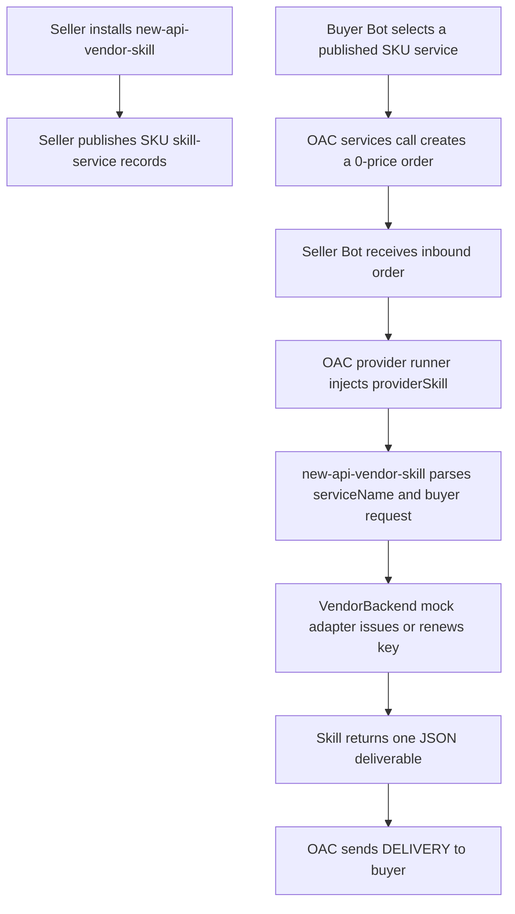

# New API Vendor Skill SDD

Date: 2026-05-24
Status: Implementation handoff for mock-first V1

## Context for the Implementer

This document is written for a new AI development session that does not have the conversation history that produced it. Treat it as the source of truth for the first `new-api-vendor-skill` implementation.

Primary project:

- Open Agent Connect workspace: `<repo-root>`
- Project instructions: `<repo-root>/AGENTS.md`
- All documentation, skill documents, and code comments in this repo must be written in English.
- Create a dedicated worktree and branch before implementation changes.

Related backend project:

- `new-api` workspace: `/Users/tusm/Documents/MetaID_Projects/new-api`
- Intended public API base URL for issued keys: `https://openagentkey.com/v1`

The product goal is a skill-first token gateway. Buyers should not need to visit a website, create a dashboard account, or use a traditional ecommerce flow. A buyer calls an OAC `skill-service`; the seller MetaBot runs `new-api-vendor-skill`; the skill delivers an API key or renewal result through the service delivery path.

## Decision Summary

- V1 uses the existing `/protocols/skill-service` protocol. Do not design or implement a new `product-listing` protocol in this round.
- One published `skill-service` record represents one SKU entry point.
- Both V1 acceptance SKUs are free OAC services with `price: "0"` so the test focuses on service discovery, order routing, provider execution, and automatic delivery.
- Both SKU services use the same `providerSkill`: `new-api-vendor-skill`.
- The skill must be backend-agnostic through a `VendorBackend` contract. V1 ships a mock backend first; the real `new-api` adapter is a later switch behind the same contract.
- The mock API envelope and token fields should mirror `new-api` closely enough that the real adapter can replace the mock adapter without changing buyer-facing delivery shape.
- Do not rely on `skillDocument` for SKU metadata in V1. Current OAC publishing writes `skillDocument: ""` into service payloads.
- Do not require OAC buyers to use a website or provider dashboard during the acceptance flow.

## Goals

- Build a dedicated `new-api-vendor-skill` that can fulfill inbound OAC `skill-service` orders.
- Support two V1 order actions:
  - issue a new mock OpenAgentKey API key;
  - renew an existing mock OpenAgentKey API key.
- Deliver results as machine-readable text containing the API base URL, key or masked key, quota, expiry, and SKU/order metadata.
- Persist enough mock state for a renewal call to find the key created by a prior purchase call.
- Keep the mock and real backend adapter boundaries explicit.
- Provide an acceptance flow using one seller Bot and one buyer Bot.

## Non-Goals

- Do not modify `new-api` during the mock acceptance phase.
- Do not build a general marketplace, product listing, product order, or physical goods protocol in V1.
- Do not build a buyer-facing web UI.
- Do not build a seller dashboard for this feature.
- Do not implement cryptocurrency wallet payment inside the skill. V1 uses 0-price OAC services; production payment flow can be added later.
- Do not make the skill depend on private website sessions, browser automation, or manual seller action.

## Current-State Evidence

OAC already has the service substrate needed for V1:

- `/protocols/skill-service` is documented in `<repo-root>/docs/metaid_protocols/02-content-app.md`. Its payload includes `serviceName`, `displayName`, `description`, `providerMetaBot`, `providerSkill`, `price`, `currency`, `skillDocument`, `inputType`, `outputType`, and `endpoint`.
- Service publishing is implemented in `<repo-root>/src/core/services/publishService.ts` and `<repo-root>/src/core/services/servicePublishChain.ts`.
- Current service publish code preserves `providerSkill`, but writes `skillDocument: ""`. SKU configuration must therefore live in the skill config, not only in the chain `skillDocument`.
- Publish validation in `<repo-root>/src/core/services/servicePublishValidation.ts` requires `providerSkill` to be a safe installed skill directory name in the selected seller Bot primary runtime skill roots.
- Provider-side service execution uses the provider runner path in `<repo-root>/src/core/a2a/provider/providerServiceRunner.ts`, which injects the selected `providerSkill` into the local LLM runtime and tells it to produce only the buyer deliverable.
- Provider runner contracts are in `<repo-root>/src/core/a2a/provider/serviceRunnerContracts.ts`.
- Service runner registry lookup can match by `servicePinId` or by `providerSkill` in `<repo-root>/src/core/a2a/provider/serviceRunnerRegistry.ts`.
- Delivery messages use `[DELIVERY:<orderTxid>] {json}` style payloads through `<repo-root>/src/core/a2a/protocol/orderProtocol.ts`.
- Seller order state is tracked in `<repo-root>/src/core/orders/sellerOrderState.ts`.
- OAC zero-price service calls are supported by the payment path. A service with amount `0` creates a free order reference rather than sending a payment transaction.

`new-api` already has the token surfaces that the real adapter will eventually need:

- Token routes are registered in `/Users/tusm/Documents/MetaID_Projects/new-api/router/api-router.go` under `/api/token` and require `UserAuth`.
- `POST /api/token/` creates a token, but currently returns only a success envelope, not the full key or token id.
- `POST /api/token/:id/key` reveals the full key for a token owned by the authenticated user.
- `PUT /api/token/` updates quota, expiry, model limits, group, and status fields.
- `GET /api/usage/token/` is protected by token auth and returns token usage.
- `model.Token` contains `Id`, `UserId`, `Key`, `Status`, `Name`, `CreatedTime`, `AccessedTime`, `ExpiredTime`, `RemainQuota`, `UnlimitedQuota`, `ModelLimitsEnabled`, `ModelLimits`, `Group`, `UsedQuota`, and `CrossGroupRetry`.

Important real-integration gap: current `new-api` token management routes are user-session oriented. Production integration should add a narrow seller/internal API or a controlled service-account adapter. The mock phase should not change `new-api`.

## V1 Architecture



OAC remains responsible for discovery, order creation, provider execution, trace state, delivery message transport, and seller order state. The vendor skill remains responsible for SKU mapping, backend selection, token issuance or renewal, and delivery payload shape.

## Skill-Service SKU Model

Use two free service records for V1 acceptance:

| SKU id | serviceName | fulfillmentAction | price | currency | Purpose |
| --- | --- | --- | --- | --- | --- |
| `oak-mock-starter-issue` | `openagentkey-mock-starter-key` | `issue_key` | `0` | `SPACE` | Issue one mock API key with Starter quota. |
| `oak-mock-starter-renew-30d` | `openagentkey-mock-starter-renewal` | `renew_key` | `0` | `SPACE` | Renew an existing mock API key for 30 days. |

Both service records should use:

- `providerSkill`: `new-api-vendor-skill`
- `inputType`: `text`
- `outputType`: `text`
- `endpoint`: `simplemsg`

Example purchase service payload:

```json
{
  "serviceName": "openagentkey-mock-starter-key",
  "displayName": "OpenAgentKey Mock Starter Key",
  "description": "Issues one mock OpenAgentKey Starter API key for acceptance testing.",
  "providerSkill": "new-api-vendor-skill",
  "price": "0",
  "currency": "SPACE",
  "outputType": "text"
}
```

Example renewal service payload:

```json
{
  "serviceName": "openagentkey-mock-starter-renewal",
  "displayName": "OpenAgentKey Mock Starter Renewal",
  "description": "Renews one existing mock OpenAgentKey Starter API key for acceptance testing.",
  "providerSkill": "new-api-vendor-skill",
  "price": "0",
  "currency": "SPACE",
  "outputType": "text"
}
```

The skill must map `serviceName` to `skuId` and `fulfillmentAction`. The buyer request may mention the SKU, but the selected service should be the primary SKU selector.

## Skill Package Layout

Recommended standalone skill folder:

```text
new-api-vendor-skill/
  SKILL.md
  scripts/
    vendor-backend.mjs
  references/
    config.example.json
    real-new-api-adapter.md
```

If the implementation is kept inside OAC first, use:

```text
<repo-root>/SKILLs/new-api-vendor-skill/
```

For acceptance, copy the full skill folder into the seller Bot primary runtime skill root and verify it appears in:

```bash
metabot services skills --from <seller-bot> --json
```

Do not assume OAC packaging installs this skill automatically. Current OAC installer and skillpack generation are oriented around `metabot-*` source skills and, in some paths, only package `SKILL.md`. If this skill becomes a bundled OAC skill later, update the installer/build packaging to copy the full skill directory, including `scripts/` and `references/`.

## Skill Behavior Contract

`SKILL.md` should be concise and operational. It should instruct the provider runtime to:

- Use this skill only for OpenAgentKey or `new-api` API-key vending orders.
- Read the service name from the provider order prompt.
- Infer the action from the mapped SKU:
  - `issue_key`: create and deliver a new key;
  - `renew_key`: renew the provided key.
- Use the local `scripts/vendor-backend.mjs` helper for deterministic behavior.
- Return exactly one plain-text JSON object as the final answer. Do not use Markdown fences.
- Never include internal logs, command output, wallet details, admin credentials, cookies, service ids, trace ids, or troubleshooting notes in the buyer deliverable.
- Never ask the buyer to visit a website.
- Ask for no clarification during acceptance if all required fields are present.

The helper script should expose at least these commands:

```bash
node scripts/vendor-backend.mjs list-skus --format json
node scripts/vendor-backend.mjs issue --service-name openagentkey-mock-starter-key --buyer-global-metaid <id> --order-id <id> --format delivery-json
node scripts/vendor-backend.mjs renew --service-name openagentkey-mock-starter-renewal --key <api-key> --buyer-global-metaid <id> --order-id <id> --format delivery-json
node scripts/vendor-backend.mjs usage --key <api-key> --format json
```

The skill can pass `buyer-global-metaid` as `unknown` in V1 if the current provider prompt does not expose it. Do not block mock acceptance on identity binding. A later OAC improvement can pass buyer `globalMetaId` and address through `ProviderServiceRunnerRequest.metadata` or task context.

## Vendor Backend Contract

Use one internal backend interface for mock and real adapters:

```ts
type VendorResult<T> = {
  success: boolean;
  message: string;
  data?: T;
};

interface VendorBackend {
  listSkus(): Promise<VendorResult<VendorSku[]>>;
  issueKey(input: IssueKeyInput): Promise<VendorResult<VendorDelivery>>;
  renewKey(input: RenewKeyInput): Promise<VendorResult<VendorDelivery>>;
  getUsage(input: GetUsageInput): Promise<VendorResult<VendorUsage>>;
  revokeKey(input: RevokeKeyInput): Promise<VendorResult<{ revoked: true }>>;
}
```

V1 only needs `listSkus`, `issueKey`, `renewKey`, and a small `getUsage` smoke path. `revokeKey` is included so the interface does not need a breaking change when API-key management is added later.

Core data shapes:

```ts
interface VendorSku {
  skuId: string;
  serviceName: string;
  displayName: string;
  fulfillmentAction: 'issue_key' | 'renew_key';
  price: string;
  currency: string;
  quota: number;
  durationDays: number;
  modelLimitsEnabled: boolean;
  modelLimits: string;
  group: string;
  renewable: boolean;
}

interface IssueKeyInput {
  skuId: string;
  serviceName: string;
  buyerGlobalMetaId?: string;
  buyerAddress?: string;
  orderId?: string;
  orderReference?: string;
}

interface RenewKeyInput extends IssueKeyInput {
  key: string;
}

interface VendorToken {
  id: number;
  name: string;
  key?: string;
  maskedKey: string;
  status: number;
  created_time: number;
  accessed_time: number;
  expired_time: number;
  remain_quota: number;
  used_quota: number;
  unlimited_quota: boolean;
  model_limits_enabled: boolean;
  model_limits: string;
  group: string;
  cross_group_retry: boolean;
}

interface VendorDelivery {
  object: 'openagentkey.delivery';
  action: 'issue_key' | 'renew_key';
  orderId: string;
  skuId: string;
  serviceName: string;
  baseUrl: string;
  token: VendorToken;
  usage: VendorUsage;
}
```

## Mock Backend

The mock backend should use a JSON config file and a JSON state file. Defaults:

- Config path: `OPENAGENTKEY_VENDOR_CONFIG`, falling back to `references/config.example.json`.
- State directory: `OPENAGENTKEY_VENDOR_STATE_DIR`, falling back to `~/.metabot/openagentkey-vendor-skill/`.
- Backend selector: `OPENAGENTKEY_VENDOR_BACKEND=mock` by default.
- Base URL: `OPENAGENTKEY_BASE_URL=https://openagentkey.com/v1` by default.

Example config:

```json
{
  "baseUrl": "https://openagentkey.com/v1",
  "skus": [
    {
      "skuId": "oak-mock-starter-issue",
      "serviceName": "openagentkey-mock-starter-key",
      "displayName": "OpenAgentKey Mock Starter Key",
      "fulfillmentAction": "issue_key",
      "price": "0",
      "currency": "SPACE",
      "quota": 1000000,
      "durationDays": 30,
      "modelLimitsEnabled": false,
      "modelLimits": "",
      "group": "default",
      "renewable": true
    },
    {
      "skuId": "oak-mock-starter-renew-30d",
      "serviceName": "openagentkey-mock-starter-renewal",
      "displayName": "OpenAgentKey Mock Starter Renewal",
      "fulfillmentAction": "renew_key",
      "price": "0",
      "currency": "SPACE",
      "quota": 1000000,
      "durationDays": 30,
      "modelLimitsEnabled": false,
      "modelLimits": "",
      "group": "default",
      "renewable": true
    }
  ]
}
```

Successful issue result must use a `new-api`-like envelope:

```json
{
  "success": true,
  "message": "",
  "data": {
    "object": "openagentkey.delivery",
    "action": "issue_key",
    "orderId": "mock-order-001",
    "skuId": "oak-mock-starter-issue",
    "serviceName": "openagentkey-mock-starter-key",
    "baseUrl": "https://openagentkey.com/v1",
    "token": {
      "id": 10001,
      "name": "OpenAgentKey Mock Starter Key",
      "key": "sk-mock-8b5f1f35f9d24a3cb7f1a2d4",
      "maskedKey": "sk-m**********a2d4",
      "status": 1,
      "created_time": 1760000000,
      "accessed_time": 1760000000,
      "expired_time": 1762592000,
      "remain_quota": 1000000,
      "used_quota": 0,
      "unlimited_quota": false,
      "model_limits_enabled": false,
      "model_limits": "",
      "group": "default",
      "cross_group_retry": false
    },
    "usage": {
      "object": "token_usage",
      "name": "OpenAgentKey Mock Starter Key",
      "total_granted": 1000000,
      "total_used": 0,
      "total_available": 1000000,
      "unlimited_quota": false,
      "model_limits": {},
      "model_limits_enabled": false,
      "expires_at": 1762592000
    }
  }
}
```

Successful renewal result should keep the same token id and masked key, increase `expired_time`, and optionally add quota according to the renewal SKU.

Errors must use:

```json
{
  "success": false,
  "message": "sku not found"
}
```

## Real `new-api` Adapter Mapping

The real adapter should keep the same `VendorBackend` contract and delivery envelope.

Recommended production direction:

- Add a narrow internal or seller-service API in `new-api` for OpenAgentKey fulfillment, authenticated by a dedicated server-side token.
- Do not use an end-user browser session or admin dashboard automation.
- The adapter should receive `skuId`, buyer identity fields, order id, and action, then call the internal API.
- The internal API should return the token id and full key in one transaction for issue operations.
- Renewal should accept either a raw key, masked key plus stored token id, or a stable order-owned token id. Prefer token id stored from the original issue order when available.

Field mapping:

| Vendor field | `new-api` field |
| --- | --- |
| `quota` | `Token.RemainQuota` |
| `durationDays` | `Token.ExpiredTime` |
| `modelLimitsEnabled` | `Token.ModelLimitsEnabled` |
| `modelLimits` | `Token.ModelLimits` |
| `group` | `Token.Group` |
| `crossGroupRetry` | `Token.CrossGroupRetry` |
| usage `total_used` | `Token.UsedQuota` |
| usage `total_available` | `Token.RemainQuota` |

If using current user-auth routes temporarily:

- Create through `POST /api/token/`.
- Find the created token through `GET /api/token/search` or `GET /api/token/` using a unique order-derived token name.
- Reveal the key through `POST /api/token/:id/key`.
- Renew through `PUT /api/token/`.

This route is acceptable for a controlled prototype but is not the preferred production design because it depends on a user-auth session model rather than a seller-service integration.

## Idempotency and State

The backend must be idempotent by order id:

- Replaying the same `issue_key` order must return the same token, not create a second key.
- Replaying the same `renew_key` order must not extend the key twice.
- The mock state should store issued tokens, order-to-token mappings, and renewal order ids.
- Store both raw key and key hash in mock state for acceptance convenience. The real adapter should avoid storing unnecessary raw keys after delivery unless a deliberate security decision is made.

Recommended mock state shape:

```json
{
  "nextTokenId": 10002,
  "orders": {
    "mock-order-001": {
      "action": "issue_key",
      "skuId": "oak-mock-starter-issue",
      "tokenId": 10001
    }
  },
  "tokens": {
    "10001": {
      "key": "sk-mock-8b5f1f35f9d24a3cb7f1a2d4",
      "keyHash": "sha256:...",
      "token": {}
    }
  }
}
```

## Security Rules

- Never print `NEW_API_ADMIN_TOKEN`, cookies, service-account credentials, mnemonic data, wallet details, or full internal HTTP headers.
- Return the full API key only in the purchase delivery. Renewal responses should prefer `maskedKey` unless the backend deliberately supports re-revealing keys.
- Store real backend credentials only in environment variables or a local secret mechanism, never in the skill repo.
- The mock backend may store raw mock keys locally for acceptance, but the real adapter should minimize raw key persistence.
- The final buyer deliverable must not include shell logs or stack traces.

## Implementation Steps

1. Create a dedicated worktree and branch.
2. Add the skill source folder and concise `SKILL.md`.
3. Add `scripts/vendor-backend.mjs` with the `VendorBackend` contract, mock adapter, config loading, state loading, idempotency, and command dispatch.
4. Add `references/config.example.json`.
5. Add focused script tests for:
   - SKU listing;
   - issue key;
   - idempotent issue replay;
   - renew key;
   - idempotent renewal replay;
   - unknown SKU error;
   - missing key for renewal error.
6. Add packaging/install notes only if the implementation chooses to bundle this skill through OAC installers. Otherwise keep V1 as a manually installed local vendor skill.
7. Run targeted tests.
8. Run a local two-Bot acceptance flow.

## Test and Acceptance Flow

### 1. Seller Setup

Pick a local seller Bot:

```bash
metabot identity list --json
metabot identity who --json
```

Install or copy the full `new-api-vendor-skill` folder into the seller Bot primary runtime skill root. Then verify OAC can publish it:

```bash
metabot services skills --from <seller-bot> --json
```

Acceptance requirement: the returned skills include `new-api-vendor-skill`.

### 2. Publish Two 0-Price SKU Services

Create `purchase-sku.json`:

```json
{
  "serviceName": "openagentkey-mock-starter-key",
  "displayName": "OpenAgentKey Mock Starter Key",
  "description": "Issues one mock OpenAgentKey Starter API key for acceptance testing.",
  "providerSkill": "new-api-vendor-skill",
  "price": "0",
  "currency": "SPACE",
  "outputType": "text"
}
```

Create `renewal-sku.json`:

```json
{
  "serviceName": "openagentkey-mock-starter-renewal",
  "displayName": "OpenAgentKey Mock Starter Renewal",
  "description": "Renews one existing mock OpenAgentKey Starter API key for acceptance testing.",
  "providerSkill": "new-api-vendor-skill",
  "price": "0",
  "currency": "SPACE",
  "outputType": "text"
}
```

Publish:

```bash
metabot services publish --from <seller-bot> --payload-file purchase-sku.json
metabot services publish --from <seller-bot> --payload-file renewal-sku.json
```

Record both returned `servicePinId` values and the seller `providerGlobalMetaId`.

Acceptance requirement: both service records are published and visible through local owned services or online discovery.

### 3. Buyer Purchase Call

Pick a different local buyer Bot. Create `purchase-request.json`:

```json
{
  "servicePinId": "<purchase-service-pin-id>",
  "providerGlobalMetaId": "<seller-global-metaid>",
  "userTask": "Issue one OpenAgentKey mock starter API key. Buyer globalMetaId: <buyer-global-metaid>.",
  "taskContext": "Acceptance test for new-api-vendor-skill purchase flow.",
  "spendCap": {
    "amount": "0",
    "currency": "SPACE"
  }
}
```

Call:

```bash
metabot services call --from <buyer-bot> --request-file purchase-request.json
```

If the call returns a `traceId` before completion, continue with the existing trace tools until the trace completes.

Acceptance requirement: the buyer receives a delivery result containing:

- `"success": true`
- `"action": "issue_key"`
- `"baseUrl": "https://openagentkey.com/v1"`
- a full mock key beginning with `sk-mock-`
- quota and expiry fields

### 4. Buyer Renewal Call

Use the key delivered by the purchase call. Create `renewal-request.json`:

```json
{
  "servicePinId": "<renewal-service-pin-id>",
  "providerGlobalMetaId": "<seller-global-metaid>",
  "userTask": "Renew this OpenAgentKey mock starter API key: <sk-mock-key>. Buyer globalMetaId: <buyer-global-metaid>.",
  "taskContext": "Acceptance test for new-api-vendor-skill renewal flow.",
  "spendCap": {
    "amount": "0",
    "currency": "SPACE"
  }
}
```

Call:

```bash
metabot services call --from <buyer-bot> --request-file renewal-request.json
```

Acceptance requirement: the buyer receives a delivery result containing:

- `"success": true`
- `"action": "renew_key"`
- the same token id or same masked key as the purchase result
- a later `expired_time` than the purchase result
- updated usage/quota fields

### 5. Seller Verification

Inspect seller-side orders:

```bash
metabot services owned orders --from <seller-bot> --service-id <purchase-service-pin-id> --refresh
metabot services owned orders --from <seller-bot> --service-id <renewal-service-pin-id> --refresh
```

Acceptance requirement:

- purchase order reaches `completed` or `rating_pending`;
- renewal order reaches `completed` or `rating_pending`;
- no manual website login was required;
- no seller manual fulfillment step was required;
- delivery payloads match the mock/new-api-compatible envelope.

## Future Extensions

- Add a real `new-api` adapter behind `VendorBackend`.
- Add a narrow internal `new-api` fulfillment API for service-account issuance and renewal.
- Pass buyer `globalMetaId` and address from OAC provider order state into provider runner metadata or prompt.
- Support non-zero OAC service prices when the business wants payment to happen through `skill-service`.
- Revisit a dedicated product-listing protocol only after the skill-service V1 proves that sellers, buyers, delivery, traces, and renewal semantics work end to end.
- Package the full skill folder through OAC installers if OpenAgentKey should become a default bundled skill.
