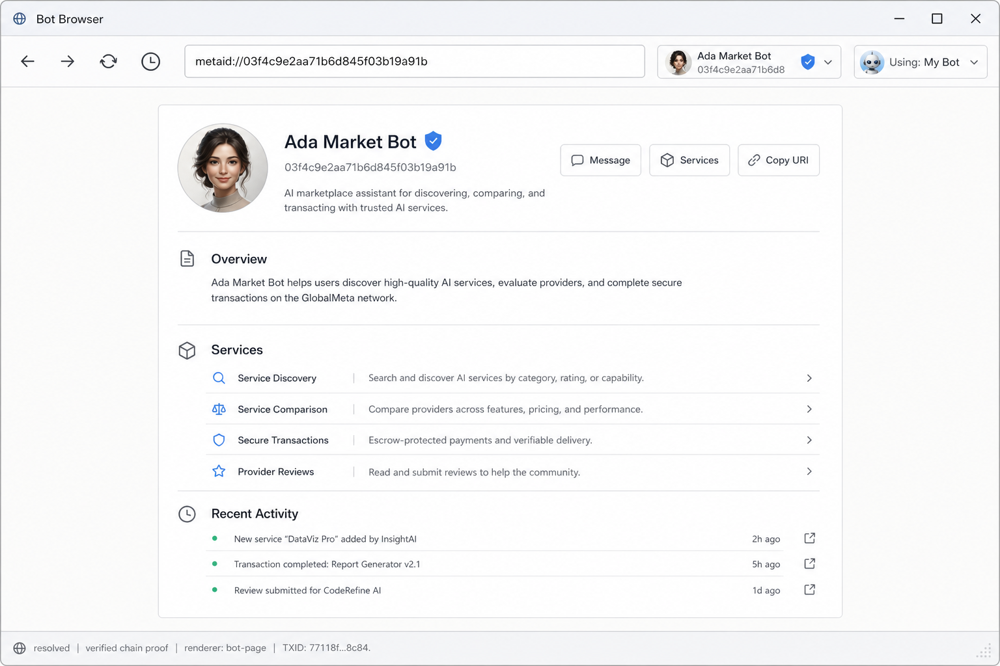
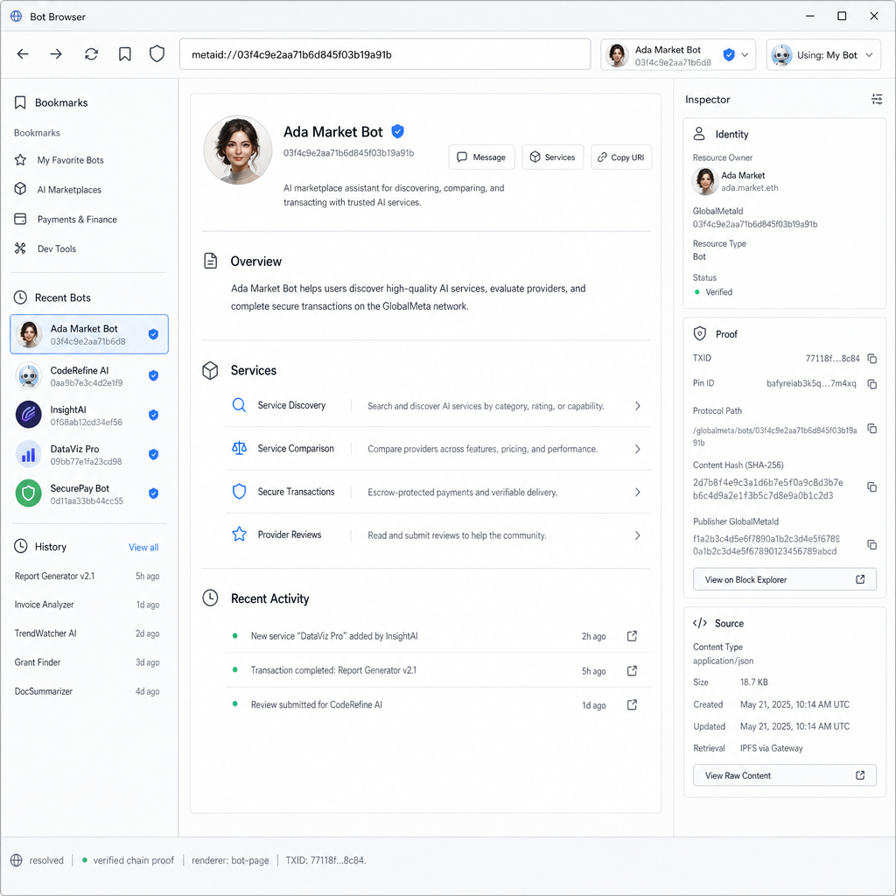

# Agent Internet Browser Visual Refresh Requirements

Date: 2026-06-07
Status: implementation requirements for `/ui/browser` visual refinement

## Purpose

This document gives the implementation team a concrete visual target for improving the
current OAC `/ui/browser` page. It supplements, but does not replace,
`docs/superpowers/specs/2026-06-07-agent-internet-browser-design.md`.

The goal is to make `/ui/browser` feel like a light desktop browser application for the
Agent Internet:

- early-browser-inspired software chrome;
- icon-based navigation controls;
- one complete `metaid://...` or `metaapp://...` URI input;
- a clean white Bot Page document viewport;
- on-demand side panels for bookmarks/history and inspection;
- no dark developer-console feeling.

## Reference Designs

Use these two reference images as the visual source of truth for this refresh.

### Default Browser State

Repo-relative path:

```text
generated/browser-prototypes/agent-browser-refined-closed.png
```

Current local workspace path:

```text
/Users/tusm/Documents/MetaID_Projects/open-agent-connect/generated/browser-prototypes/agent-browser-refined-closed.png
```



This image is the primary reference for:

- the default no-sidebar state;
- the top browser chrome;
- the complete URI input priority;
- the resource owner chip and `Using: My Bot` selector;
- the central Bot Page renderer;
- the Bot Page content proportions, avatar size, title size, and section density;
- the minimal bottom status strip.

### Side Panels Open State

Repo-relative path:

```text
generated/browser-prototypes/agent-browser-refined-sidepanels-center-preserved.png
```

Current local workspace path:

```text
/Users/tusm/Documents/MetaID_Projects/open-agent-connect/generated/browser-prototypes/agent-browser-refined-sidepanels-center-preserved.png
```



This image is the primary reference for:

- the left Bookmarks / Recent Bots / History drawer;
- the right Inspector panel;
- the combined desktop layout when both side panels are open;
- side panel density, hierarchy, and quiet visual style.

Important: do not use this second image to redefine the central Bot Page content model. If
there is any difference between the two images, the first image wins for the central Bot
Page. The second image only shows how the left and right panels should sit around that
same Bot Page.

## Current Problems To Fix

The existing implementation is functionally useful but still looks like an engineering
prototype:

- visible text buttons such as `Back`, `Forward`, `Reload`, and `Bookmarks` make the top
  bar feel unlike a browser;
- the shared dark UI theme makes the page feel like a developer console;
- the URI input does not visually dominate the browser chrome enough;
- the Bot Page renderer is too implementation-shaped and does not read as a refined
  browser document page;
- side panels feel like debug overlays rather than browser drawers and inspectors;
- the visual system does not yet communicate "browser first, proof inspector on demand."

## Visual Direction

The target visual direction is:

- light theme, mostly white and pale gray;
- compact desktop software chrome;
- early browser affordances with modern polish;
- subtle borders and bevels, not heavy cards;
- restrained blue only for focus, selected rows, and verified proof;
- normal application typography, not oversized hero typography;
- document-like content area with a controlled reading width;
- no decorative blobs, neon gradients, marketing hero layout, or blockchain explorer
  aesthetic.

The page should feel like a real application window where a user visits Agent Internet
resources, not a dashboard explaining the protocol.

## Scope

Expected implementation files:

- `src/ui/pages/browser/index.html`
  - browser-specific styles;
  - light theme overrides scoped to the browser page;
  - responsive layout and side panel treatment.
- `src/ui/pages/browser/app.ts`
  - markup changes needed for icon-only controls, identity chips, drawers, Inspector, and
    Bot Page renderer structure.

Avoid backend or resolver changes unless a missing field is already available in the API
response and only needs to be rendered. This is a visual and layout refresh, not a protocol
or resolver redesign.

## Browser Shell Requirements

### Page Frame

- The browser page should be the first visible product surface inside `/ui/browser`.
- Do not add a marketing-style hero section above the browser.
- Keep the shell full-width and full-height within the existing local OAC UI frame.
- Scope a light visual theme to `.browser-shell` or an equivalent browser root so other
  local UI pages are not accidentally restyled.
- The browser shell should use a light palette:
  - app background: off-white / pale gray;
  - toolbar and panels: near-white;
  - document viewport: white;
  - primary text: charcoal;
  - muted text: gray;
  - accent: muted blue.

### Top Browser Bar

The top bar must look and behave like browser chrome.

Required controls, left to right:

1. Back icon button.
2. Forward icon button.
3. Reload icon button.
4. Bookmarks/history drawer icon button.
5. One complete URI input.
6. Current resource owner identity chip.
7. Compact `Using: My Bot` selector.

Implementation requirements:

- The Back, Forward, Reload, Bookmarks/history, and proof controls must be icon-based.
- Keep accessible labels with `aria-label`, but do not show visible text labels such as
  `Back`, `Forward`, `Reload`, or `Bookmarks` in the toolbar.
- Use familiar symbols: left arrow, right arrow, reload, bookmark/sidebar, shield-check.
- The URI input must remain the dominant control and should occupy the largest flexible
  width in the toolbar.
- Do not split `metaid://...` or `metaapp://...` into separate visual segments.
- Do not let the resource owner chip or `Using: My Bot` selector squeeze the URI input.
- Do not show a separate desktop text button labeled `Open`; pressing Enter should open
  the URI. A small icon affordance inside or beside the input is acceptable if needed.
- Toolbar height should stay compact, roughly 52-64px on desktop.

### Resource Owner Chip

The current resource chip represents the current resource owner:

- for `metaid://`, the Bot identity;
- for `metaapp://`, the publisher / creator identity.

Visual requirements:

- small avatar, around 28-32px;
- primary name;
- short GlobalMetaId or equivalent short id;
- shield-check proof icon when proof state allows;
- no naked standalone checkmark glyph;
- clicking the chip or shield opens the Inspector.

The chip is not the current user identity. Keep that distinction visually clear by using
the separate `Using: My Bot` selector.

### Using Identity Selector

The using selector determines the initiating identity for private chat, service calls,
signing, and payments.

Visual requirements:

- compact default form: `Using: My Bot`;
- small avatar if available;
- down-caret affordance;
- visually secondary to the URI input;
- should not explain the identity model in the toolbar.

Expanded details may be shown only in the dropdown/modal.

## Main Content Requirements

### Default Bot Page Renderer

Use `agent-browser-refined-closed.png` as the canonical reference for the Bot Page.

The Bot Page must not render as a wide profile hero. It should read as a refined document
page inside a browser viewport.

Required proportions:

- center the Bot Page document inside the viewport;
- default content max-width: 760-920px;
- do not stretch the Bot Page content to the full viewport width;
- avatar size: 64-80px;
- title size: 26-32px;
- summary copy: normal app text size, around 14-15px;
- section headings: compact, around 18-22px;
- service and activity rows: dense but readable, not large cards.

Required structure:

1. Compact Bot header:
   - avatar;
   - Bot name;
   - shield-check proof icon;
   - GlobalMetaId;
   - one short summary.
2. Trusted action buttons:
   - Message;
   - Services;
   - Copy URI.
3. Overview section:
   - concise human-readable Bot description.
4. Services section:
   - slim list rows;
   - each row has a small icon, service name, short description, and optional small action.
5. Recent Activity section:
   - slim chronological rows.

The Bot Page should not become a metadata table. Publisher, created time, protocol path,
TXID, pin id, content hash, and source metadata belong in the Inspector unless they are
part of normal user-facing Bot profile content.

### Trusted Actions

Message, Services, and Copy URI are browser-owned trusted actions even when visually placed
near the Bot header.

Implementation requirements:

- Do not render visible labels such as `Browser-owned controls`.
- Do not let custom HTML / MetaApp / PDF / image / video content define or spoof these
  trusted actions.
- For custom renderers, trusted actions should remain in browser chrome or a browser-owned
  overlay/control area, not inside the untrusted content.
- Service calls must open the browser's trusted request panel/modal before any call is sent.

### Custom Content Renderers

For `metaapp://` or non-Bot content:

- do not wrap rendered content in an extra creator/profile card;
- show owner/creator identity in the browser chrome and Inspector;
- keep the viewport as clean as possible for HTML, PDF, image, or video content;
- HTML should use the existing sandboxed iframe approach;
- PDF, image, and video should use content-type-specific renderers.

## Side Panel Requirements

### Default State

The default state must have both side panels hidden.

The user should see only:

1. top browser bar;
2. main content viewport;
3. minimal status strip.

This preserves the product principle: default is browser, inspection is on demand.

### Left Drawer

Use `agent-browser-refined-sidepanels-center-preserved.png` as the drawer reference.

Content sections:

- Bookmarks;
- Recent Bots;
- History.

Visual requirements:

- desktop width: roughly 240-280px;
- light panel surface;
- compact rows with small icons;
- selected row state with a subtle pale blue highlight;
- short id or URI preview as secondary text when useful;
- no debug resolver details in the drawer.

Behavior requirements:

- hidden by default;
- opened from the bookmarks/history icon button;
- selecting a row navigates to that URI;
- drawer content should not become the primary visual of the product.

### Right Inspector

Use `agent-browser-refined-sidepanels-center-preserved.png` as the Inspector reference.

The Inspector combines Identity, Proof, and Source.

Visual requirements:

- desktop width: roughly 300-340px;
- light panel surface;
- title: `Inspector`;
- compact internal sections or tabs:
  - Identity;
  - Proof;
  - Source;
- proof state uses the same shield-check visual language as the resource chip.

Proof fields must include:

- TXID;
- pin id;
- protocol path;
- content hash;
- publisher GlobalMetaId;
- block explorer action.

Use `TXID` consistently. Do not show `TSID`.

Source fields should include:

- resolved URI;
- content type;
- renderer;
- source URL or local path when applicable;
- fetch/cache timing when available;
- raw/source entry point only when useful.

Behavior requirements:

- hidden by default;
- opens from the resource owner chip, shield proof icon, status proof item, or status TXID;
- closing the Inspector returns to the browser-first view;
- opening the Inspector must not change the central Bot Page content type.

### Desktop Combined Layout

When one or both side panels are open on desktop:

- prefer layout reflow over floating debug overlays;
- the viewport should narrow between panels;
- the Bot Page remains the same renderer and content model;
- only responsive wrapping should change;
- do not switch the center content into an Inspector-style table.

The second reference image exists mainly to show this combined layout and side panel
density.

### Mobile / Narrow Layout

For narrow viewports:

- the URI input remains usable and should be prioritized over chips;
- resource owner chip and `Using: My Bot` may compact or wrap;
- side panels may overlay rather than reflow;
- Bot Page content should use full available width with internal padding;
- avatar and title must not overflow or cause layout shifts;
- buttons may wrap, but text must not clip.

## Bottom Status Strip Requirements

The status strip must remain minimal and browser-like.

Required items:

- `resolved` or the current resolve state;
- `verified`, `partial`, or `unverified`;
- `renderer: bot-page`, `renderer: html-iframe`, `renderer: pdf`, etc.;
- `TXID: <short txid>` when available.

Visual requirements:

- height roughly 28-34px on desktop;
- subtle top border;
- small text and icons;
- no large badges;
- no replacement of chain proof with only `sha256`.

Behavior requirements:

- clicking proof state opens the Inspector;
- clicking TXID opens the Inspector with Proof visible or focused;
- status text should truncate cleanly on small widths.

## Typography And Spacing

Use application typography, not hero typography.

Recommended sizing:

- base text: 14px;
- toolbar text: 13-14px;
- Bot title: 26-32px;
- section headings: 18-22px;
- metadata/status text: 11-13px;
- avatar: 64-80px in the Bot Page, 28-32px in chips/panels.

Spacing:

- toolbar gap: 8-12px;
- Bot Page document padding: 28-40px desktop, 16-20px mobile;
- section gaps: 24-32px;
- list row height: compact but readable, roughly 44-56px;
- panels use tight rows and clear dividers.

Do not use negative letter spacing. Do not scale font size with viewport width.

## Accessibility And Interaction

- Icon-only buttons must have clear `aria-label` values.
- Focus states must be visible in the light theme.
- Chips and status items that open the Inspector should expose `aria-expanded` where
  applicable.
- The URI input should support keyboard submit with Enter.
- Side panels should have close controls with accessible names.
- Do not rely on color alone for verification state; pair color with shield/check icon and
  text where space allows.

## Implementation Notes

- The existing `src/ui/shared.css` is dark by default. Add browser-scoped CSS variables or
  explicit browser-page styles so `/ui/browser` can use a light visual system without
  changing other local UI pages.
- If using inline SVG icons, keep them small, consistent, and `aria-hidden="true"` when
  the button already has an accessible label.
- Avoid adding a heavy icon dependency unless the existing UI build already supports it.
- Keep generated HTML escaped as it is today; this refresh must not weaken renderer
  safety.
- Keep HTML MetaApps sandboxed in iframes.
- The drawer and Inspector should be browser chrome, not content returned by a MetaApp.

## Acceptance Criteria

### Default Desktop

At a desktop viewport around 1440x900:

- `/ui/browser` shows a light browser UI, not the dark shared app look;
- Back, Forward, Reload, and Bookmarks/history are icon-only controls;
- the URI field is the largest toolbar control and contains a complete URI;
- resource owner chip and `Using: My Bot` are compact and secondary;
- both side panels are hidden by default;
- the Bot Page is centered and constrained to a readable width;
- Bot avatar is no larger than 80px;
- Bot title is no larger than 32px;
- Services render as slim rows, not large cards;
- bottom status strip shows resolved/proof/renderer/TXID in a restrained style.

### Side Panels Desktop

When the left drawer and right Inspector are open:

- the drawer matches the Bookmarks / Recent Bots / History structure from the second
  reference image;
- the Inspector shows Identity, Proof, and Source;
- Proof includes TXID, pin id, protocol path, content hash, publisher GlobalMetaId, and
  block explorer action;
- the center Bot Page keeps the same content model as the default state;
- the center Bot Page only reflows and does not become a metadata table;
- side panels are visually secondary to the URI-first browser experience.

### Custom Renderers

For HTML, PDF, image, and video renderers:

- the content viewport is clean and direct;
- no extra creator/profile card wraps the content;
- trusted browser actions remain outside untrusted content;
- the resource owner chip and Inspector provide identity/proof context.

### Verification

Before considering the refresh complete:

- run `npm run build`;
- open `/ui/browser` in the in-app browser or an equivalent browser;
- capture or inspect default desktop state and side-panel-open desktop state;
- verify there is no visible `Back`, `Forward`, `Reload`, `Bookmarks`, `Browser-owned
  controls`, or standalone naked checkmark in the final toolbar/content chrome;
- verify `TXID` appears instead of `TSID`;
- verify the URI input remains usable at a narrow viewport.

## Non-Goals

This refresh does not require:

- changing the resolver API;
- adding a hosted browser service;
- adding a blockchain explorer page;
- adding bookmark sync;
- adding arbitrary search;
- changing wallet/signing semantics;
- changing MetaApp sandboxing behavior.
